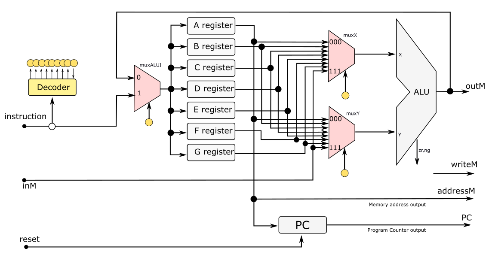

# Av3 - 1° Semestre de 2024


Avaliação 3 - Elementos de Sistemas

| Pontos HW | Pontos SW |
|:---------:|:---------:|
| 20        | 35        |

- Avaliação **individual**.
- **120 min** total.
- Ficar no blackboard durante a prova.
- Clonar o seu repositório (e trabalhar nele)
- Fazer **commit** ao final de cada questão.
- Lembre de dar **push** ao final.


As questões de hardware devem ser implementadas nos arquivos localizados na pasta `src/vhd`, as questões de software (`nasm`) devem ser implementadas nos arquivos localizados em `src/nasm`. 

Não há testes para a parte de HW.

Para testar SW, execute:

```
./compileALL.py
pytest --tb=no -s
```


**LEMBRE DE REALIZAR UM COMMIT (A CADA QUESTÃO) E DAR PUSH AO FINALIZAR**

## 1. Assembly - parte 1

**Sutração de valores**

| Pontos HW | Pontos SW |
|:---------:|:---------:|
| 0         | 5        |

Faça um programa em Assembly que realize a operação RAM[3] = RAM[RAM[1]] - RAM[RAM[0]].

    
#### Exemplo 1:

Representação na memória:
```
RAM[0]  ="0000000000000100"
RAM[1]  ="0000000000000111"
RAM[4]  ="0000000000001010"
RAM[7]  ="0000000000001011"
```
Resultado:
```
RAM[3]  ="0000000000000001"
```

### Implementação

Implemente o código Assembly no arquivo `src/nasm/sub_indireta.nasm`

**Lembre de descomentar o módulo no arquivo config_testes_nasm.txt e testar com `pytest --tb=no -s`**

#### Rubrica para avaliação:

| Pontos SW | Descritivo                                                         |
|-----------|--------------------------------------------------------------------|
| 5         | Demonstrar conhecimento dos comandos básicos do Assembly utilizado |


## 2. Assembly - parte 2

**Subtração condicional**

| Pontos HW | Pontos SW |
|:---------:|:---------:|
| 0         | 10        |

Faça um código em Assembly que realize a operação RAM[3] = RAM[RAM[1]] - RAM[RAM[0]] apenas se RAM[1] for maior que RAM[0].
    
#### Exemplo 1:

Representação na memória:
```
RAM[0]  ="0000000000000100"
RAM[1]  ="0000000000000111"
RAM[4]  ="0000000000001010"
RAM[7]  ="0000000000001011"
```
Resultado:
```
RAM[3]  ="0000000000000001"
```

#### Exemplo 2:

Representação na memória:
```
RAM[0]  ="0000000000000111"
RAM[1]  ="0000000000000100"
RAM[4]  ="0000000000001010"
RAM[7]  ="0000000000001011"
```
Resultado:
```
RAM[3]  = inalterado!
```

### Implementação

Implemente o código Assembly no arquivo `src/nasm/sub_if.nasm`

**Lembre de descomentar o módulo no arquivo config_testes_nasm.txt e testar com `pytest --tb=no -s`**

#### Rubrica para avaliação:

| Pontos SW | Descritivo                                                                   |
|-----------|------------------------------------------------------------------------------|
| 10        | Demonstrar conhecimento da realização de condicionais em Assembly            |


## 3. Assembly - parte 3

**Calcule um vetor das diferenças**

| Pontos HW | Pontos SW |
|:---------:|:---------:|
| 0         | 20        |

Considere um vetor de n valores armazenados na RAM a partir da posição RAM[20]. 
O número n está indicado na posição RAM[0].

Escreva um programa em Assembly que calcule o vetor das diferenças (ex. RAM[21] - RAM[20], RAM[22] - RAM[21], etc....) e salve na RAM a partir da posição [30].

Os LEDs devem mostrar o número de diferenças calculadas em binário.

    
#### Exemplo 1:

Valores iniciais na memória:
```
RAM[0]  = "0000000000000101"
RAM[20] = "1111111111111111"
RAM[21] = "0000000000001000"
RAM[22] = "0000000000001010"
RAM[23] = "0000000000001011"
RAM[24] = "0000000000001001"
```
Resultado:
```
RAM[30] = "0000000000001001"
RAM[31] = "0000000000000010"
RAM[32] = "0000000000000001"
RAM[33] = "1111111111111110"
LEDs    = "0000000000000100"
```

### Implementação

Implemente o código Assembly no arquivo `src/nasm/diff.nasm`

**Lembre de descomentar o módulo no arquivo config_testes_nasm.txt e testar com `pytest --tb=no -s`**

#### Rubrica para avaliação:

| Pontos SW | Descritivo                                              |
|-----------|---------------------------------------------------------|
| 15        | Demonstrar conhecimento de realização loops em Assembly |
| 5         | Demonstrar conhecimento da utilização de periféricos    |


## 4. CPU modificada

**JMP**

| Pontos HW | Pontos SW |
|:---------:|:---------:|
| 20        |   0       |

Queremos alterar a estrutura da CPU para ter mais flexibilidade nas operações com a ULA. Para isso, foram incluidos registradores e os mux, como indicado na figura.
 




Dessa forma, o formato das instruções passará a ter 20 bits, conforme apresentado a seguir:


onde os bits r2 r1 r0 na instrução tipo A indica qual dos registradores irá carregar um valor a partir da instrução.
Para as instruções do tipo C, os vetores bits (x2 x1 x0) e (y2 y1 y0) selecionam os registradores ou a entrada da memória que serão usados na entradas X e Y da ULA. Já os bits d2 d1 d0 indicam em qual registrador o resultado da ULA será salvo. O valor d2d1d0 = "000" não salva o resultado da ULA em nenhum registrador. Já o bit dM indica o salvamento na memória RAM. Nesta versão da CPU, pode-se salvar em 1 registrador e na memória em um mesmo ciclo de clock.

### Questões

Baseado nesta versão do CPU:

1. Determine qual seria o vetor de 20 bits a ser fornecido para a _ControlUnit_ para que o CPU realize uma operação "subw %A, %G, (%A), %B".
2. Seria possível alterar essa CPU sem mudar o tamanho dos bits de instrução para que um valor seja carregado diretamente em 2 registradores? Em caso afirmativo, explique como seria feito. Em caso negativo, explique o porquê.
3. Escreva a expressão para o sinal de load do registrador F em VHDL.
4. Esta CPU modificada permite realizar saltos diretamente (_em apenas 1 instrução_) comparando dois valores diferentes de zero? Explique.

Responda a questão no arquivo CPU.txt


#### Rubrica para avaliação:

| Pontos HW | Descritivo         |
|-----------|--------------------|
| 5         | Cada item correto. |